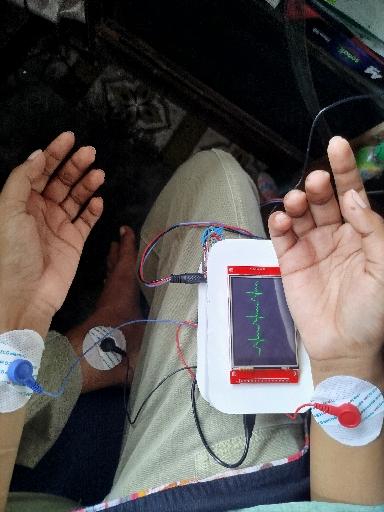
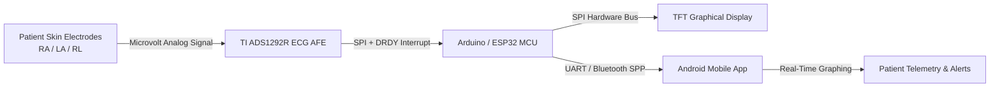

# ❤️ Portable ECG Monitoring & Heart Disease Detection System

[](https://opensource.org/licenses/MIT)
[](https://www.arduino.cc/)
[](https://isocpp.org/)
[](https://appinventor.mit.edu/)
[]()

A high-performance, low-cost **Portable ECG Monitoring and Heart Disease Detection System** built with **Arduino / ESP32**, Texas Instruments **ADS1292R 24-bit Analog Front-End (AFE)**, onboard SPI **TFT graphical display**, and an **Android mobile application**.

The device captures real-time cardiac electrogram signals, performs QRS complex peak detection, computes heart rate in Beats Per Minute (BPM), detects electrode lead-off conditions, and streams live telemetry via Bluetooth for visualization and automated cardiac anomaly alerting.

---

## 📸 System Showcase & Visual Gallery

| Hardware Device Build | Custom PCB Blueprint |
| :---: | :---: |
|  |  |

| 3D PCB Render | Real-Time Hardware Testing |
| :---: | :---: |
|  |  |


---

## 🌟 Key Features

* 🫀 **24-bit High Precision ECG Acquisition**: Interfaced with TI ADS1292R AFE over SPI bus for ultra-low noise biological signal digitization.
* ⚡ **Real-Time QRS Detection Algorithm**: Executes real-time bandpass filtering and R-peak extraction to compute continuous Heart Rate (BPM).
* 🖥️ **Onboard TFT Oscilloscope Screen**: High-speed SPI rendering engine displaying live ECG waveforms and heart rate statistics directly on the device.
* 🔌 **Automated Electrode Lead-Off Detection**: Detects detached electrodes instantly and alerts the operator on screen to prevent false diagnostic readouts.
* 📡 **Wireless Telemetry & Mobile App**: Transmits serial data over Bluetooth SPP to an Android companion application (`ECG_Monitor.aia`).
* 🚨 **Automated Cardiac Anomaly Alerts**: Real-time evaluation of heart rate boundaries (detecting Bradycardia < 60 BPM and Tachycardia > 100 BPM).
* 🔋 **Portable & Low Power**: Compact circuit layout optimized for battery operation and point-of-care remote healthcare environments.

---

## 📐 System Architecture



---

## 📚 Complete Project Documentation

Detailed technical documentation and engineering guides are available in the [`doc/`](./doc) directory:

| Document | Focus Area | Contents |
| :--- | :--- | :--- |
| 🏗️ [**System Architecture**](./doc/architecture.md) | Hardware & Electronics | Circuit block diagrams, component BOM, pin mappings, and custom PCB schematics. |
| 💻 [**Firmware Guide**](./doc/firmware.md) | Embedded Code & Signal Processing | SPI protocol configuration, digital filtering, QRS peak detection algorithm, and TFT graphics sweep engine. |
| 📱 [**Mobile Application**](./doc/mobile_app.md) | Android App & GUI | MIT App Inventor project setup, Bluetooth SPP connection manager, graphing engine, and alert logic. |
| 🚀 [**Setup & Deployment**](./doc/setup_guide.md) | Installation & Operations | Prerequisites, Arduino IDE library installation, step-by-step firmware flashing, and troubleshooting matrix. |
| 📡 [**Telemetry & API Spec**](./doc/api_and_data_spec.md) | Protocol & Data Formats | Serial baud rate specs, frame packet layout, status flags, and cloud IoT JSON data schemas. |

---

## 📌 Pin Configuration Matrix

Below is the hardware pin connection table between the microcontroller and the ADS1292R module as implemented in [`Portable_ECG_and_Heart_Rate_Monitoring.ino`](Portable_ECG_and_Heart_Rate_Monitoring.ino):

| Pin Name | MCU Pin | Direction | Description |
| :--- | :--- | :--- | :--- |
| `ADS1292_DRDY_PIN` | Pin 2 | Input | Hardware Data Ready interrupt trigger. |
| `ADS1292_CS_PIN` | Pin 15 | Output | SPI Chip Select pin (Active Low). |
| `ADS1292_START_PIN` | Pin 4 | Output | ADC hardware conversion start control. |
| `ADS1292_PWDN_PIN` | Pin 5 | Output | Hardware Power Down / Reset control line. |
| `SPI_MOSI / MISO / SCK` | Standard SPI Pins | Master/Slave | SPI Communication Interface (Mode 1, 1MHz). |

---

## ⚡ Quick Start Guide

### 1. Hardware Assembly
1. Connect the ADS1292R module to your Arduino / ESP32 board following the pin matrix above.
2. Connect the TFT screen to the MCU SPI hardware pins.
3. Attach 3-lead biomedical electrodes to RA, LA, and RL (Driven Right Leg) reference points.

### 2. Flash Firmware
1. Install required Arduino libraries: `protocentralAds1292r` and `TFT_eSPI`.
2. Open [`Portable_ECG_and_Heart_Rate_Monitoring.ino`](Portable_ECG_and_Heart_Rate_Monitoring.ino) in Arduino IDE.
3. Select your microcontroller board model and COM port.
4. Compile and upload firmware. Verify output in Serial Monitor at `57600 baud`.

### 3. Install Mobile App
1. Load [`ECG_Monitor.aia`](ECG_Monitor.aia) in [MIT App Inventor](http://ai2.appinventor.mit.edu/).
2. Build and download the `.apk` package to your Android phone.
3. Turn on Bluetooth, pair with the hardware Bluetooth module, open the app, and click **Connect**.

> 💡 For comprehensive setup instructions, see the [Setup & Calibration Guide](./doc/setup_guide.md).

---

## 📂 Repository Directory Structure

```
Portable-ECG-Monitoring/
│
├── 📜 README.md                                # Project landing page & documentation hub
├── 💻 Portable_ECG_and_Heart_Rate_Monitoring.ino# Main C++ Arduino embedded firmware
├── 📱 ECG_Monitor.aia                          # MIT App Inventor Android mobile project file
│
├── 📚 doc/                                     # Technical Documentation Directory
│   ├── 🏗️ architecture.md                      # System hardware architecture & PCB design
│   ├── 💻 firmware.md                          # Firmware architecture & signal algorithms
│   ├── 📱 mobile_app.md                        # Mobile application interface & alert logic
│   ├── 🚀 setup_guide.md                       # Complete setup, installation & troubleshooting
│   └── 📡 api_and_data_spec.md                 # Serial telemetry protocol & data packet spec
│
└── 🖼️ images/                                  # Visual Assets & Hardware Photographs
    ├── ECG Monitor.jpg                         # Fully assembled prototype device photo
    ├── PCB_Design.jpeg                         # PCB schematic circuit layout blueprint
    ├── PCB_Design_3D.jpeg                      # 3D render of custom PCB design
    ├── Real-time_check_1.jpg                   # Hardware setup during initial bench test
    ├── Real-time-check_2.jpg                   # Real-time testing on TFT oscilloscope display
    ├── Real-time-check_3.jpeg                  # Live ECG telemetry on Android mobile application
    └── Aleart_message.jpeg                     # Diagnostic alarm alert prompt on mobile app
```

---

## ⚠️ Medical Disclaimer

> **IMPORTANT**: This project is designed strictly for **educational, research, and prototyping purposes**. It is not a certified medical device and should not be used as a substitute for professional medical diagnosis, treatment, or clinical monitoring.

---

## 🔮 Roadmap & Future Enhancements

- [ ] **TinyML Integration**: Deploy TensorFlow Lite Micro model directly on MCU for on-device arrhythmia classification.
- [ ] **Cloud Telemetry**: Integrate MQTT protocol for streaming patient data to AWS IoT / Firebase dashboards.
- [ ] **GPS Emergency System**: Trigger automatic SMS/GPS location alert dispatched to caregivers when severe cardiac distress is flagged.
- [ ] **Multi-Lead Expansion**: Expand hardware interface to support 12-lead diagnostic ECG reading capability.

---

## 👨‍💻 Author & Credits

**Bipronath Saha**  
*B.Sc. in Electrical & Electronic Engineering*  
GitHub: [@BipronathSaha12](https://github.com/BipronathSaha12)

---

## 📜 License

This project is licensed under the [MIT License](LICENSE).

