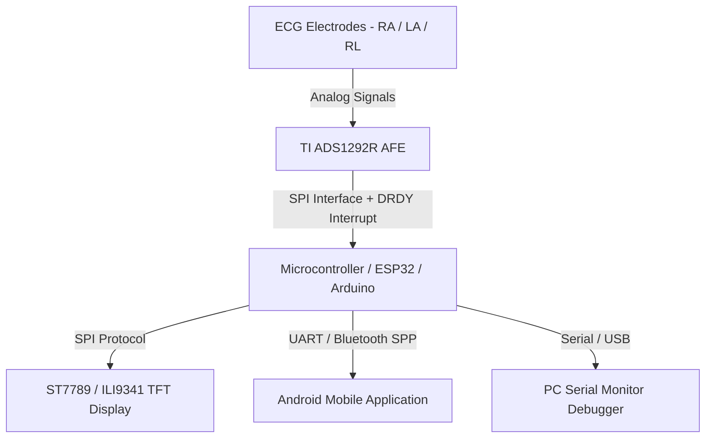
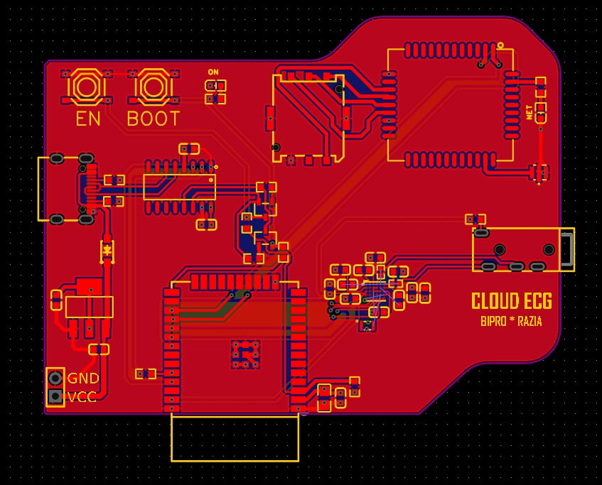
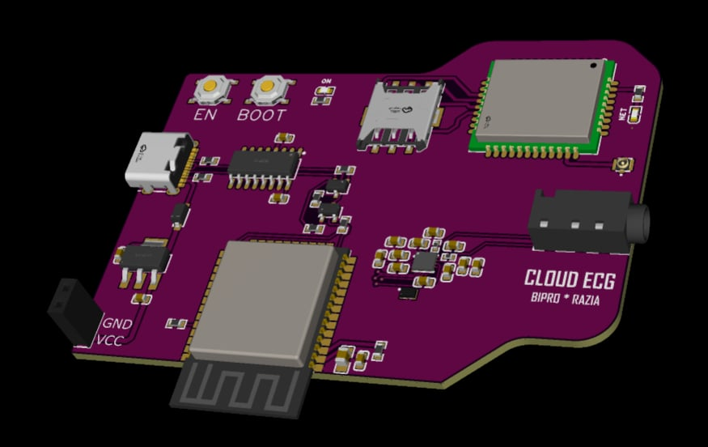

# 🏗️ Hardware & System Architecture

This document provides a detailed technical breakdown of the hardware architecture, component selection, circuit connections, and PCB design for the **Portable ECG Monitoring and Heart Rate Detection System**.

---

## 📐 System Overview

The system is designed around a modular embedded architecture consisting of an analog front-end (AFE), micro-controller unit (MCU), onboard TFT graphical display, and Bluetooth telemetry module connected to a mobile terminal.

---

## 🔌 Component Specifications

| Component | Specification / Part Number | Description / Function |
| :--- | :--- | :--- |
| **Analog Front-End (AFE)** | Texas Instruments ADS1292R | 24-bit Analog-to-Digital Converter (ADC) with integrated ECG front-end & respiration impedance measurement. |
| **Microcontroller Unit** | ESP32 / Arduino Nano / Uno | High-speed processing of digital signal streams, QRS algorithm execution, and TFT rendering. |
| **Display Unit** | TFT LCD (SPI Interface) | Real-time onboard rendering of ECG waveforms and digital heart rate output. |
| **Wireless Module** | HC-05 / HC-06 (or ESP32 BLE/WiFi) | Telemetry interface transmitting computed BPM and filtered waveform data to Android devices. |
| **ECG Electrodes** | Ag/AgCl Disposable Electrodes | 3-lead skin contact electrode configuration (Right Arm, Left Arm, Right Leg ground). |
| **Power Management** | 3.3V / 5V DC Regulator / LiPo Battery | Stable low-noise power supply to prevent mains noise interference on ECG acquisition. |

---

## 📌 Pin Mapping & Interfacing

The table below outlines the exact pin connections between the microcontroller and the ADS1292R ECG chip as configured in `Portable_ECG_and_Heart_Rate_Monitoring.ino`:

### ADS1292R Signal Interface

| ADS1292R Pin | MCU Pin | Signal Direction | Description |
| :--- | :--- | :--- | :--- |
| `DRDY` | Pin 2 | Input | Data Ready hardware interrupt signal. |
| `CS` | Pin 15 | Output | SPI Chip Select line (Active Low). |
| `START` | Pin 4 | Output | Hardware conversion start trigger. |
| `PWDN / RESET` | Pin 5 | Output | Hardware Power Down / Reset control line. |
| `MOSI` | MCU SPI MOSI | Output | SPI Master Output Slave Input. |
| `MISO` | MCU SPI MISO | Input | SPI Master Input Slave Output. |
| `SCK` | MCU SPI SCK | Output | SPI Clock Line (configured to SPI Mode 1, 1MHz). |

---

## 🎨 Custom PCB Layout & Hardware Designs

The system incorporates a custom PCB design to minimize electromagnetic interference (EMI) and signal noise on sensitive microvolt-level cardiac signals.

### 2D PCB Layout Blueprint

### 3D Render of PCB Module

---

## ⚡ Electrode Placement & Setup

The system uses a 3-lead Einthoven Lead system for signal acquisition:

1. **RA (Right Arm / Red)**: Attached to the right upper chest or wrist.
2. **LA (Left Arm / Yellow)**: Attached to the left upper chest or wrist.
3. **RL (Right Leg / Green or Black)**: Attached to the right lower abdomen or leg serving as the Driven Right Leg (DRL) reference for common-mode noise cancellation.
