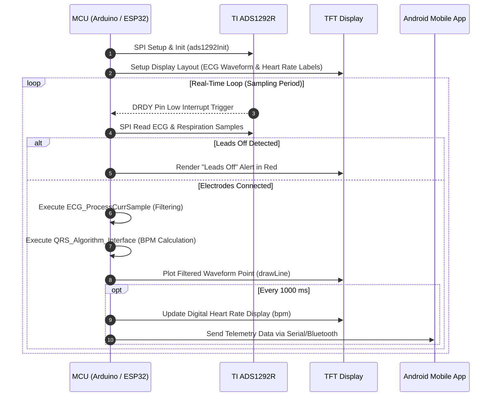

# 💻 Firmware Architecture & Signal Processing

This document explains the firmware structure, SPI communication protocols, real-time signal processing algorithms, QRS complex detection, and display rendering implemented in [`Portable_ECG_and_Heart_Rate_Monitoring.ino`](../Portable_ECG_and_Heart_Rate_Monitoring.ino).

---

## 🛠️ Software Dependencies

The firmware relies on the following core embedded libraries:
* **`protocentralAds1292r.h`**: Low-level driver for configuration, register reading/writing, and SPI raw data extraction from the TI ADS1292R AFE.
* **`ecgRespirationAlgo.h`**: Real-time digital filtering, bandpass noise reduction, QRS complex detection, and BPM calculation algorithms.
* **`SPI.h`**: Standard Arduino hardware SPI bus library.
* **`TFT_eSPI.h`**: High-performance graphics driver library for SPI TFT displays.

---

## 🔄 Firmware Execution Flow



---

## 🧮 Signal Processing Pipeline

### 1. Raw Sample Acquisition
Raw 24-bit ADC samples are converted and shifted from 24-bit signed integer values down to 16-bit format:
```cpp
ecgWaveBuff = (int16_t)(ecgRespirationValues.sDaqVals[1] >> 8);
```

### 2. Digital Filtering & Artifact Removal
Raw biological signals contain baseline wander (respiration / body motion) and high-frequency powerline interference (50Hz / 60Hz noise). The signal pipeline applies digital bandpass filtering:
```cpp
ECG_RESPIRATION_ALGORITHM.ECG_ProcessCurrSample(&ecgWaveBuff, &ecgFilterout);
```

### 3. QRS Detection & BPM Calculation
The QRS interface identifies R-peak spikes in the cardiac cycle by executing differentiation, squaring, and dynamic threshold integration (Pan-Tompkins algorithm principle):
```cpp
ECG_RESPIRATION_ALGORITHM.QRS_Algorithm_Interface(ecgFilterout, &globalHeartRate);
```

### 4. Electrode Lead-Off Detection
The ADS1292R chip constantly monitors skin-electrode contact impedance. If any electrode detaches:
```cpp
if (ecgRespirationValues.leadoffDetected == true) {
    ecgFilterout = 0;
    // Render "Leads Off" status warning on display
}
```

---

## 🖥️ Screen Rendering Engine

The onboard TFT screen renders a continuous sweep oscilloscope display:
- **X-Axis Sweep**: Sweeps left-to-right (`xPos++`). Upon reaching `tft.width()`, screen clears black and resets `xPos = 0`.
- **Y-Axis Mapping**: Maps raw signed filter values (`-1000` to `1000`) into screen vertical pixel bounds (`35` to `tft.height() - 10`).
- **Smooth Plotting**: Connects consecutive points with anti-aliased lines (`tft.drawLine(...)`) for seamless waveform visualization.
