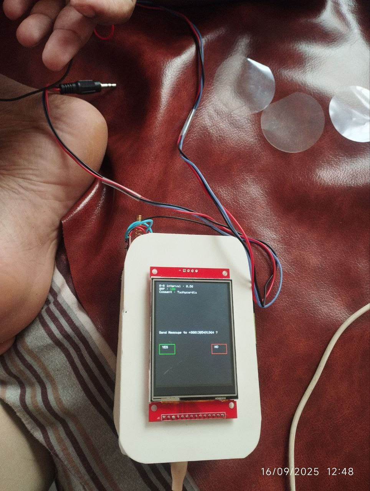
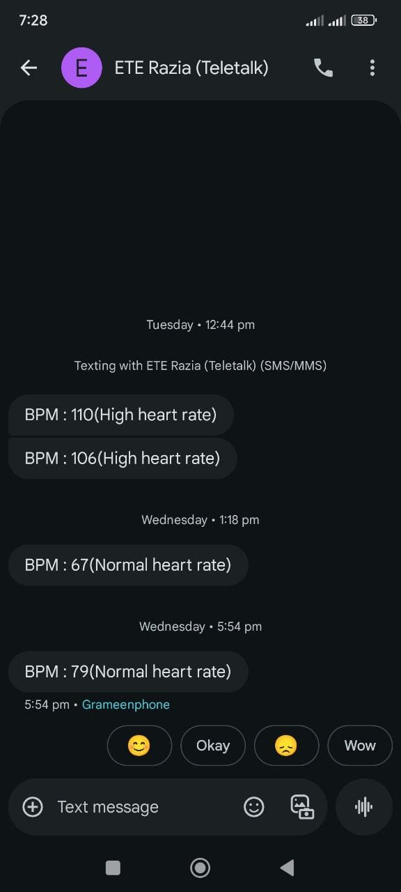

# 📱 Mobile Application & GUI Interface

This document details the mobile app companion designed in **MIT App Inventor** (`ECG_Monitor.aia`), its Bluetooth SPP interface, real-time plotting engine, and automated diagnostic alert features.

---

## 📱 Application Overview

The companion mobile application functions as a handheld ECG monitor display and cardiac diagnostic assistant. It pairs wirelessly with the embedded hardware unit over Bluetooth.

### Key Functionalities
- 📡 **Bluetooth SPP Connection Manager**: Scan, pair, and establish real-time serial streaming with HC-05/HC-06/ESP32 Bluetooth modules.
- 📈 **Real-Time ECG Graphing**: Dynamic canvas plotting rendering live cardiac electrogram waveforms.
- ⏱️ **Heart Rate Monitor**: Live numerical indicator displaying Heart Rate in Beats Per Minute (BPM).
- 🚨 **Automated Health Alerts**: Immediate visual and acoustic warnings upon detecting abnormal heart rhythms.
- 📁 **Patient History & Data Export**: Local storage of telemetry data for clinical review.

---

## 📸 Mobile UI & Real-Time Screenshots

### Real-Time Monitoring Display

### Automated Diagnostic Alert Dialog
When abnormal heart rates (such as severe Tachycardia or Bradycardia) are detected, an alert prompt is displayed:

---

## ⚙️ Diagnostic Rules & Alarm Thresholds

The application classifies cardiac states based on real-time calculated heart rate (BPM) and RR interval stability:

| Cardiac Condition | Heart Rate Range (BPM) | Alarm Status | Action / Message Displayed |
| :--- | :--- | :--- | :--- |
| **Bradycardia** | `< 60 BPM` | ⚠️ Warning | Low heart rate alert triggered. |
| **Normal Sinus Rhythm** | `60 - 100 BPM` | ✅ Normal | Normal cardiac pattern indication. |
| **Tachycardia** | `> 100 BPM` | 🚨 Critical Alert | High heart rate emergency notification. |
| **Leads Off / Disconnected** | `0 BPM / No Data` | 🔌 Disconnected | Check electrode attachment & Bluetooth link. |

---

## 🛠️ Importing & Modifying `.aia` Source File

1. Navigate to [MIT App Inventor](http://ai2.appinventor.mit.edu/).
2. Log in with your Google account.
3. Click on **Projects** → **Import project (.aia) from my computer**.
4. Select `ECG_Monitor.aia` located in the root directory of this repository.
5. Edit components, blocks, layout, or alert threshold parameters as needed.
6. Click **Build** → **App (provide .apk for QR code)** or **App (save .apk to my computer)** to generate the installer.
