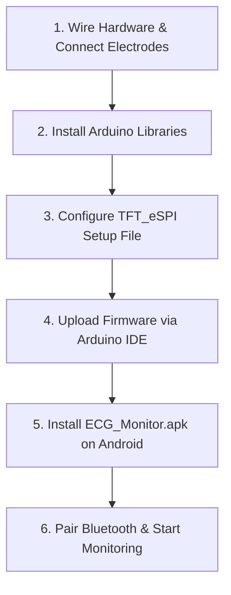

# 🚀 Setup, Installation & Calibration Guide

This comprehensive setup guide provides step-by-step instructions for assembling hardware, installing software dependencies, configuring Arduino IDE libraries, compiling firmware, and pairing the mobile app.

---

## 📋 Prerequisites & Requirements

### 1. Hardware Required
* Microcontroller: Arduino Uno / Nano / ESP32 development board.
* ECG Front-End Chip: ProtoCentral / Texas Instruments **ADS1292R Breakout Board**.
* Display Module: SPI 1.3" / 1.8" / 2.4" TFT Display (ST7789 or ILI9341 driver chip).
* Bluetooth Module: HC-05, HC-06, or ESP32 built-in Bluetooth/BLE.
* Electrodes & Cables: 3-lead Biomedical Patient Cable with Ag/AgCl disposable snap electrodes.
* Wiring: Jumper cables, breadboard or custom PCB, and 5V DC power source / battery pack.

### 2. Software Required
* [Arduino IDE](https://www.arduino.cc/en/software) (Version 1.8.x or 2.x).
* Android Device running Android 6.0 (API Level 23) or higher.
* [MIT App Inventor](http://ai2.appinventor.mit.edu/) (Optional, only needed to rebuild or edit the `.aia` project).

---

## 📦 Arduino IDE Library Setup

Before compiling [`Portable_ECG_and_Heart_Rate_Monitoring.ino`](../Portable_ECG_and_Heart_Rate_Monitoring.ino), install the following libraries:

1. **Protocentral ADS1292R Library**:
   - Download or clone the [`protocentral-ads1292r-arduino-library`](https://github.com/protocentral/protocentral-ads1292r-arduino-library).
   - In Arduino IDE, click **Sketch** → **Include Library** → **Add .ZIP Library...**.

2. **TFT_eSPI Library**:
   - Open Arduino IDE Library Manager (**Tools** → **Manage Libraries...**).
   - Search for `TFT_eSPI` by Bodmer and click **Install**.
   - Navigate to your Arduino libraries folder (`Documents/Arduino/libraries/TFT_eSPI/`).
   - Open `User_Setup.h` and configure your display driver (e.g. `ST7789_DRIVER` or `ILI9341_DRIVER`) and screen SPI pin numbers.

---

## ⚡ Step-by-Step Deployment

### Step 1: Wire the Circuit
Follow the pin connections specified in [`doc/architecture.md`](./architecture.md). Verify ground continuity between the MCU, ADS1292R, and TFT screen.

### Step 2: Flash Firmware
1. Connect MCU board to computer via USB cable.
2. Select correct Board and COM Port in Arduino IDE (**Tools** → **Board** / **Port**).
3. Open `Portable_ECG_and_Heart_Rate_Monitoring.ino`.
4. Click **Verify** (✓) to compile, then click **Upload** (➔).
5. Open Serial Monitor at **57600 baud rate** to verify initialization output (`"Initialization is done"`).

### Step 3: Mobile App Installation & Pairing
1. Download `ECG_Monitor.aia` and build the `.apk` file using MIT App Inventor.
2. Install the `.apk` file on your Android smartphone.
3. Turn on Bluetooth on your mobile phone and pair with the HC-05 / HC-06 device (Default PIN is usually `1234` or `0000`).
4. Launch the application, click **Connect Bluetooth**, and select your device from the paired list.

---

## 🔍 Troubleshooting Guide

| Symptom | Probable Cause | Recommended Action |
| :--- | :--- | :--- |
| **"Leads Off" message on TFT** | Electrodes detached or dry gel contact. | Check electrode connection to skin; replace disposable electrode pads. |
| **Flatline output / Constant 0 BPM** | Incorrect SPI wiring or missing CS / DRDY lines. | Double-check wiring to pins 2, 4, 5, and 15 on MCU. |
| **TFT screen stays blank / white** | Incorrect TFT driver settings in `User_Setup.h`. | Edit `TFT_eSPI` library setup file for correct pin mappings. |
| **Mobile app cannot connect to Bluetooth** | HC-05 module not powered or already paired to another phone. | Power-cycle HC-05 module; disconnect existing Bluetooth connections. |
| **Noisy / distorted ECG signal** | 50Hz/60Hz electromagnetic noise from mains supply. | Run MCU on battery power; ensure DRL (Right Leg) reference electrode is secured. |
